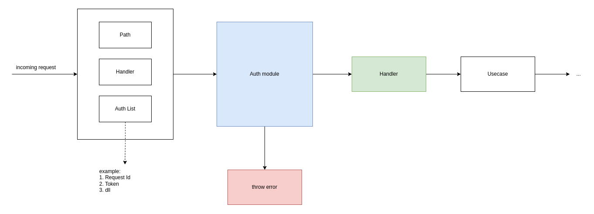

## Auth middleware
Authmiddleware lib can be use to eliminate repetitive http handler validation.

### HLA


### How to install
```
go get github.com/RobertMaulana/go-authmiddleware
```

### Example implementation

#### a. Set auth header  
```
import (
    authmiddleware "github.com/RobertMaulana/go-authmiddleware"
    "github.com/gin-gonic/gin"
)

var (
    ginC            *gin.Engine
    authMiddleware  authmiddleware.Auth
)

func init() {
    ginC = gin.Default()
    authMiddleware = authmiddleware.Init()
}

func main() {
    ginC.GET("/products", authMiddleware.AuthorizeRequest([]string{
	    authmiddleware.Platform,
	    authmiddleware.Token,
	    authmiddleware.RequestId,
    },
	    productsHandler,
    ))
    
    ginC.Run()
}

```
#### b. Get auth header 
```
func productsHandler(ctx *gin.Context) {
	platform := authMiddleware.GetPlatform()
    ctx.JSON(http.StatusOK, platform)
}
```

### Interface list
* AuthorizeRequest(authList []string, fn func(ctx *gin.Context)) func(ctx *gin.Context)
    Validation interface to check auth header
* GetRequestId() string
    Get x-request-id value
* GetToken() string
    Get x-token value
* GetPlatform() string
    Get x-platform value


